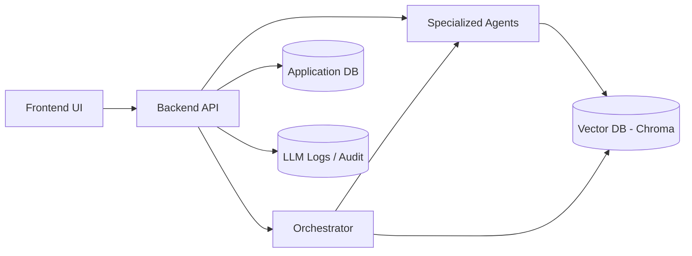

# Multi-Agent RAG Platform

A production-ready, self-hosted platform for orchestrating multiple AI agents with retrieval-augmented generation (RAG), persistent memory, and full auditability.

---

## 🚀 Overview

This project provides a **multi-agent orchestration framework** that enables structured AI collaboration to investigate complex topics.

Instead of relying on a single LLM, this system:
- Coordinates **specialized agents**
- Uses **retrieval (RAG)** for grounded responses
- Maintains **persistent memory**
- Produces **traceable, auditable outputs**

👉 Designed for real-world use cases such as:
- Research and investigation
- Risk and compliance analysis
- Knowledge synthesis
- Enterprise AI copilots

## Features

- **Three orchestration modes**
  - **Broadcast** — send the same instruction to all slave agents simultaneously and see each response individually
  - **Orchestrate** — the orchestrator discovers agent specialities, builds a sequential execution plan, and synthesises the final answer
  - **Mediator** — a structured debate between exactly two agents, with the orchestrator producing a balanced assessment
- **Persistent memory** — each agent stores interactions in its own ChromaDB vector collection (RAG)
- **Streaming responses** — real-time Server-Sent Events (SSE) for all chat modes
- **User management** — Cloudflare Access JWT auth in production; email-based dev fallback; per-user credits and agent limits; admin panel
- **Audit log** — every LLM call is recorded with request/response payloads
- **Configurable models & prompts** — manage allowed LLM models and system prompt templates via the Settings UI

## Architecture

See [`docs/ARCHITECTURE.md`](docs/ARCHITECTURE.md) for a full description of the system design, data models, and data flows.



## Quick Start (Docker)

```bash
# 1. Clone
git clone <repo-url>
cd multi-agent-investigation-rag

# 2. Generate a secret key
python -c "from cryptography.fernet import Fernet; print(Fernet.generate_key().decode())"

# 3. Configure the backend
cp backend/.env.example backend/.env
#    Edit backend/.env and set SECRET_KEY to the value generated above.
#    Optionally set DEV_USER_EMAIL and ADMIN_EMAILS for local dev access.

# 4. Configure the frontend
cp frontend/.env.example frontend/.env

# 5. Start
docker compose up --build
```

| Service | URL |
|---------|-----|
| Frontend | http://localhost:3000 |
| Backend API | http://localhost:8000 |
| API docs (Swagger) | http://localhost:8000/docs |

## Deployment

See [`docs/DEPLOYMENT.md`](docs/DEPLOYMENT.md) for full instructions, including remote SSH deployment and Cloudflare Tunnel + Traefik setup.

A Windows helper script (`dp_remote.bat`) is included for remote deployments. Edit the three configuration variables at the top of the file to match your target server before using it.

## Documentation

| Document | Contents |
|----------|----------|
| [`docs/ARCHITECTURE.md`](docs/ARCHITECTURE.md) | System design, components, data models, data flows |
| [`docs/REQUIREMENTS.md`](docs/REQUIREMENTS.md) | Functional and non-functional requirements |
| [`docs/DEPLOYMENT.md`](docs/DEPLOYMENT.md) | Deployment instructions (local, remote, Cloudflare) |
| [`docs/INFRA.md`](docs/INFRA.md) | Infrastructure pattern (Traefik + Cloudflare Tunnel) |
| [`docs/TESTS.md`](docs/TESTS.md) | Test specifications and instructions |

## Running Tests

```bash
# Backend
cd backend
pip install -r requirements.txt
pip install pytest pytest-asyncio httpx
pytest tests/ -v

# Frontend
cd frontend
npm install
npm test
```

## Environment Variables

| Variable | Description | Default |
|----------|-------------|---------|
| `SECRET_KEY` | Fernet key for encrypting agent API keys | *required* |
| `DATABASE_URL` | SQLAlchemy async DB URL | `sqlite+aiosqlite:///./data/app.db` |
| `CHROMA_PERSIST_DIR` | ChromaDB persistence directory | `./data/chroma` |
| `BACKEND_CORS_ORIGINS` | Comma-separated allowed CORS origins | `http://localhost:3000,http://localhost:5173` |
| `CF_TEAM_DOMAIN` | Cloudflare Access team name (enables JWT validation) | *(blank = dev mode)* |
| `ADMIN_EMAILS` | Comma-separated emails granted admin role | *(blank)* |
| `DEV_USER_EMAIL` | Dev-mode fallback user email | `dev@localhost` |
| `DEFAULT_USER_CREDITS` | Credits given to new users | `100` |
| `DEFAULT_AGENT_LIMIT` | Max agents per user (`-1` = unlimited) | `10` |
| `CREDITS_PER_ITERATION` | Credits deducted per chat iteration | `1` |

## Technology Stack

| Layer | Technology |
|-------|-----------|
| Frontend | React 18, TypeScript, Vite, TailwindCSS, Axios |
| Backend | Python 3.11, FastAPI, SQLAlchemy (async), Pydantic v2 |
| LLM Integration | LiteLLM (OpenAI, Anthropic, Gemini, and compatible providers) |
| Vector DB | ChromaDB (embedded, persistent) |
| Embeddings | sentence-transformers `all-MiniLM-L6-v2` (local) |
| Relational DB | SQLite (async via `aiosqlite`) |
| Auth (production) | Cloudflare Access JWT |
| Containerisation | Docker, Docker Compose |


## Repository Structure

```
backend/
  ├── app/
  │   ├── routers/
  │   ├── services/
  │   ├── models/
  │   └── schemas/
  └── tests/
frontend/
  └── src/
docs/
```

## Contributing

Contributions are welcome! Please read [CONTRIBUTING.md](CONTRIBUTING.md) for guidelines and [CODE_OF_CONDUCT.md](CODE_OF_CONDUCT.md) for community standards.

To report a security vulnerability, see [SECURITY.md](SECURITY.md).

## License

This project is licensed under the [MIT License](LICENSE).

